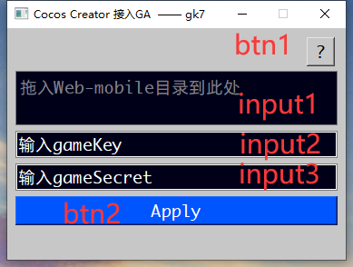
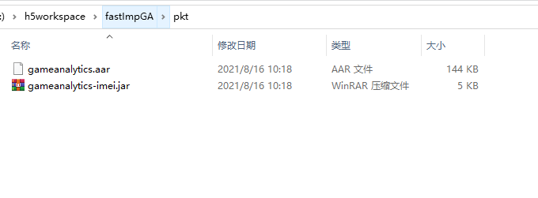

# fastImpGA
cocos creator 3.x 一键接入 GA数据后台SDK

##  窗口功能

input1: 将项目文件夹拖入输入框中（ 开发项目的根目录 例如:  D:/CocosPorj/test3d)

input2: gameKey 从发行那里获取
input3: gameSecret 从发行那里获取

btn1: 你可以点击前往工具详情文档
btn2: 开始接入  在这之前你得先确认 三个输入框中的内容正确性

## 如何更换 gameAnalytics 版本

在官网下载你需要的 gameAnalyticsSDK版本 并替换工具目录下 pkt文件夹中 .arr和.jar文件 即可

[GameAnalytics官方文档地址 https://gameanalytics.com/docs/s/](https://gameanalytics.com/docs/s/)

## 版本要求
cocos creator 3.x

后续有时间会支持 cocos creator 其它版本

后期有空会支持 Unity 2018.x,2019.x版本

## 工具其它文档
https://badapple001.github.io/fastImportGA/
